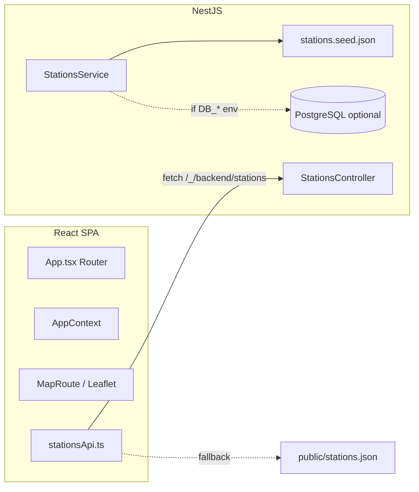

# Справка о проекте Univolt (Tashkent Explorer)

## Назначение продукта

**UniVolt** — приложение для поиска и просмотра **электрозарядных станций в Ташкенте** на одной карте: разные операторы, типы коннекторов, мощность, часы работы. По смыслу из онбординга сейчас это **каталог и карта**; в планах заявлены единый кошелёк и запуск сессии (roadmap в UI).

Имя пакета в корневом `package.json` всё ещё шаблонное (`vite_react_shadcn_ts`); бренд в интерфейсе — **UniVolt**.

---

## Структура репозитория

| Часть | Технологии | Роль |
|--------|------------|------|
| Корень | Vite 5, React 18, TypeScript, Tailwind, shadcn/ui (Radix) | SPA: карта, избранное, настройки |
| [backend/](../backend/) | NestJS 11, TypeORM, PostgreSQL (опционально) | REST API станций |
| [ios/](../ios/) | SwiftUI (файлы для переноса в Xcode) | Заготовка нативного клиента |
| [public/stations.json](../public/stations.json) | Статический снимок | Fallback, если API недоступен (например в Telegram) |

---

## Архитектура фронтенда

- **Точка входа:** [src/main.tsx](../src/main.tsx) (в т.ч. инициализация Telegram Web App — [src/telegram/webApp.ts](../src/telegram/webApp.ts)).
- **Маршруты** ([src/App.tsx](../src/App.tsx)): вложенный layout `/` → дочерние `index` (карта), `favorites`, `settings`; `basename` из `import.meta.env.BASE_URL`.
- **Состояние:** [src/context/AppContext.tsx](../src/context/AppContext.tsx) — станции через **TanStack Query**, фильтры, поиск, bbox карты, избранное (localStorage), онбординг и выбор языка.
- **Данные:** [src/infra/api/stationsApi.ts](../src/infra/api/stationsApi.ts) — база API: `{BASE_URL}/_/backend` или `VITE_API_BASE_URL`; при ошибке — [public/stations.json](../public/stations.json). Ответ валидируется **Zod**, маппинг в доменную модель [src/types/station.ts](../src/types/station.ts).
- **Домен:** фильтрация списка — [src/domain/stations/filtering.ts](../src/domain/stations/filtering.ts) (есть тесты).
- **Карта:** Leaflet + react-leaflet ([src/components/StationMap.tsx](../src/components/StationMap.tsx), тайлы — [src/theme/mapTiles.ts](../src/theme/mapTiles.ts)).
- **i18n:** RU / EN / UZ — [src/lib/i18n.tsx](../src/lib/i18n.tsx).
- **UI:** shadcn-компоненты в [src/components/ui/](../src/components/ui/), тема — [src/theme/](../src/theme/).

---

## Бэкенд (NestJS)

- **Порт:** `process.env.PORT ?? 3000` ([backend/src/main.ts](../backend/src/main.ts)); CORS `origin: true`; глобальный `ValidationPipe` (whitelist, transform).
- **Модуль станций:** [backend/src/stations/](../backend/src/stations/)
  - `GET /stations` — фильтры: `search`, `network`, `connectorType`, `minPowerKw`, `status`, bbox (`minLat`, `minLon`, `maxLat`, `maxLon`), пагинация `offset`/`limit` ([stations.controller.ts](../backend/src/stations/stations.controller.ts)).
  - `GET /stations/filters/meta` — списки для фильтров.
  - `GET /stations/:id` — одна станция.
- **Источник данных:** по умолчанию **JSON-сид** [backend/src/stations/stations.seed.json](../backend/src/stations/stations.seed.json) (копируется в `dist` через [backend/nest-cli.json](../backend/nest-cli.json) `assets`).
- **PostgreSQL:** если заданы `DB_HOST` и `DB_DATABASE` ([backend/src/app.module.ts](../backend/src/app.module.ts)), подключается TypeORM с `synchronize: true`, сущность [station.entity.ts](../backend/src/stations/entities/station.entity.ts); при пустой БД — заливка из того же сида.
- **ETL:** скрипт [backend/scripts/build-stations-from-tsv.cjs](../backend/scripts/build-stations-from-tsv.cjs), npm-скрипт `build:stations` в [backend/package.json](../backend/package.json).

---

## Локальный запуск и прокси

- **`npm run dev`** (корень): `concurrently` — `dev:api` (Nest watch) + `dev:web` (Vite на **8080**).
- Vite прокси: префикс **`/_/backend`** → `http://127.0.0.1:3000` с rewrite ([vite.config.ts](../vite.config.ts)) — тот же контракт, что на Vercel.

Скрипты корня: `build`, `preview`, `test` (Vitest), `lint` (ESLint).

---

## Деплой

- [vercel.json](../vercel.json): **experimentalServices** — фронт (Vite) на `/`, бэкенд из папки `backend` с префиксом **`/_/backend`** — согласовано с `resolveApiBaseUrl()` на клиенте.

---

## Telegram Mini App

Описано в [README.md](../README.md): `@twa-dev/sdk`, HTTPS, SPA fallback, опциональный `BASE_PATH` при сборке, проверка через туннель. **Важно:** `initData` на сервере не валидируется; для чувствительных API позже нужна проверка на бэкенде.

---

## iOS

[ios/README.md](../ios/README.md): SwiftUI-модуль `ios/UnivoltExplorer/` под отдельный Xcode-проект; те же эндпоинты API, MapKit, избранное в UserDefaults, чеклисты App Store в [ios/AppStore/](../ios/AppStore/).

---

## Тестирование

- Фронт: Vitest ([vitest.config.ts](../vitest.config.ts)), тесты домена и контракта API.
- Бэкенд: Jest (unit), e2e в [backend/test/](../backend/test/).
- Playwright: [playwright.config.ts](../playwright.config.ts), [playwright-fixture.ts](../playwright-fixture.ts).

---

## Ключевые файлы для ориентации

| Задача | Файл |
|--------|------|
| Маршруты и провайдеры | [src/App.tsx](../src/App.tsx) |
| Загрузка станций и fallback | [src/infra/api/stationsApi.ts](../src/infra/api/stationsApi.ts), [src/context/AppContext.tsx](../src/context/AppContext.tsx) |
| Модель станции (UI) | [src/types/station.ts](../src/types/station.ts) |
| API станций | [backend/src/stations/stations.controller.ts](../backend/src/stations/stations.controller.ts), [stations.service.ts](../backend/src/stations/stations.service.ts) |
| Сид данных | [backend/src/stations/stations.seed.json](../backend/src/stations/stations.seed.json) |
| Переменные БД | `DB_HOST`, `DB_DATABASE`, опционально `DB_PORT`, `DB_USER`, `DB_PASSWORD` |

---

Этого достаточно, чтобы понять стек, поток данных от сида/API до карты и как запускать и деплоить проект. Для узких тем см. [ios/README.md](../ios/README.md) и раздел Telegram в [README.md](../README.md).
